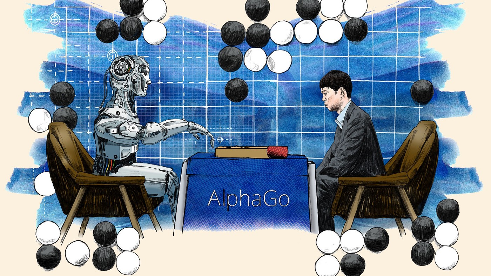

# Hi there, I'm Giuseppe 👋

I'm a **Data Scientist** with a Master's in **Artificial Intelligence** from the University of Bologna, currently working in Milan. I specialize in AWS-based data solutions, machine learning, and cloud architecture.

   

## 🚀 Interests

- ☁️ Cloud Architecture & AWS
- 🧠 Machine Learning & AI
  - 🔍 Retrieval-Augmented Generation (RAG)
  - 🎮 Reinforcement Learning
  - 📚 Natural Language Processing
- 📊 Data Science & Business Intelligence
- ⚙️ Data Engineering & ETL Pipelines

## 🛠️ Languages & Tools

&nbsp;
&nbsp;
&nbsp;
&nbsp;
&nbsp;
&nbsp;
&nbsp;
&nbsp;
&nbsp;
&nbsp;
&nbsp;
&nbsp;
&nbsp;
&nbsp;
&nbsp;

## 📬 Contacts

